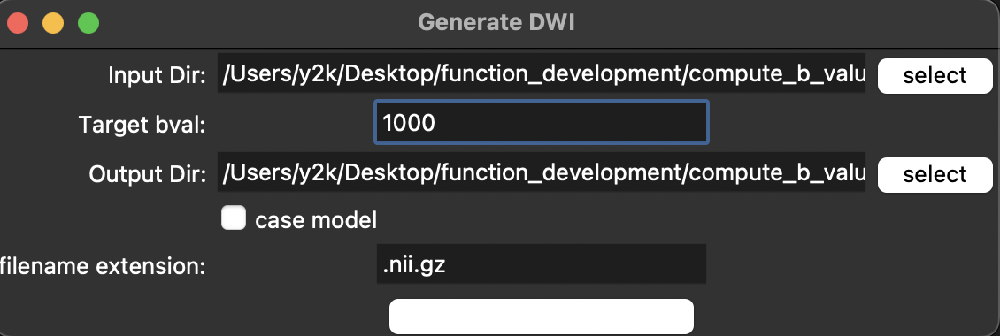

# Accurate Multi-b-Value DWI Generation Using Two-Stage Deep Learning：Multicenter Study
# Abstract: 
Background: Diffusion-weighted imaging (DWI) is essential for early screening, diagnosis, and follow-up of various diseases, especially tumors, but suffers in practice from incomplete b-values, low signal-to-noise ratio at high b-values, and lack of standardization across different anatomical regions and equipment. These issues limit the clinical adoption and accuracy of quantitative parameters such as apparent diffusion coefficient (ADC), creating a need for robust multi-b-value, multi-organ image synthesis.
Purpose:This study aimed to develop and validate a two-stage deep learning framework (DC²Anet-MineGAN) for high-fidelity multi-organ, multi-b-value DWI synthesis and accurate ADC restoration, addressing real-world limitations of DWI acquisition.
Materials and Methods:This retrospective study included DWI images collected from three hospitals (from March 2020 to March 2025) and the TCGA database, with a total of 50,000 images across five anatomical regions (brain, breast, abdomen, neck, pelvis) and b-values (0–1000 s/mm²). Images were split 8:2 into training and test sets. The two-stage model used DC²Anet for low-to-high b-value synthesis per organ and MineGAN for interpolation to arbitrary b-values. Performance was evaluated using MSE, MAE, PSNR, and SSIM, and radiologist Likert ratings with ICC for synthetic images at non-trained b-values. Group differences were assessed statistically.
Results:Of 50,000 images, synthetic ADC values closely matched ground truth across all regions (mean difference <0.02; all p>0.05), with SSIM >0.81 and PSNR >74 for all b-values. For unseen b-values (b=75, 850), 90/120 (75%) and 60/120 (50%) images were scored as excellent by radiologists; ICC exceeded 0.92 for both b-values. No significant difference was observed between synthetic and real ADC, and no regions showed inferior image quality.
Conclusion:The proposed two-stage DC²Anet-MineGAN framework achieves accurate, high-quality DWI synthesis and ADC reproduction across multiple b-values and anatomical regions, overcoming clinical DWI limitations and supporting reliable quantitative imaging.

  
